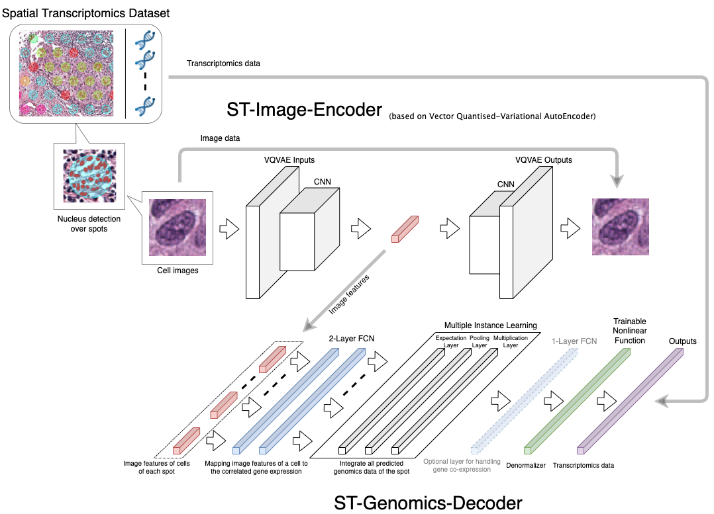
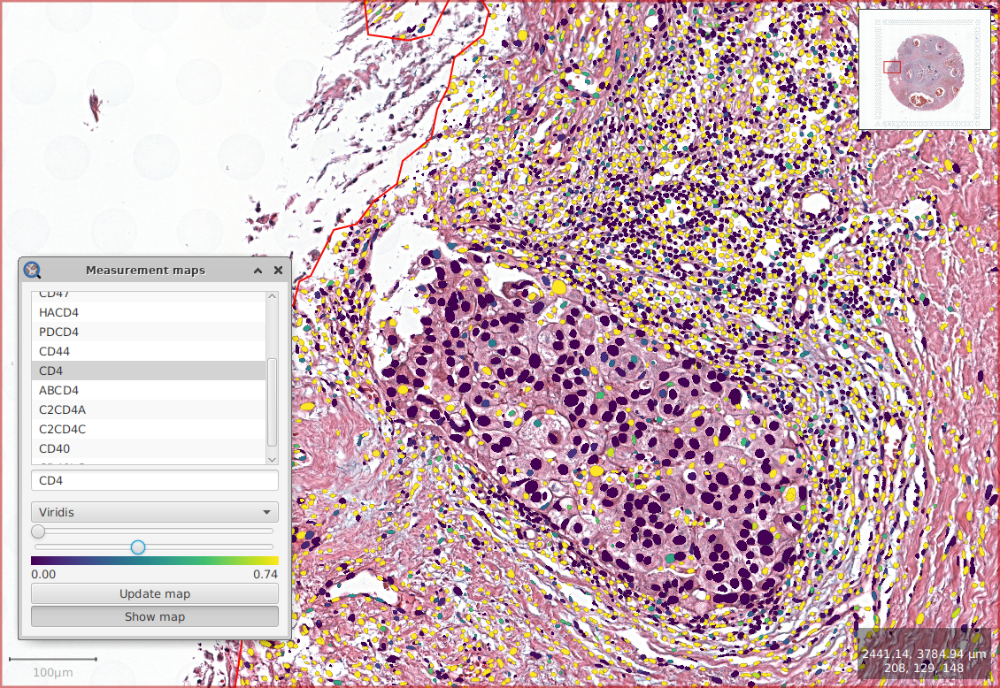
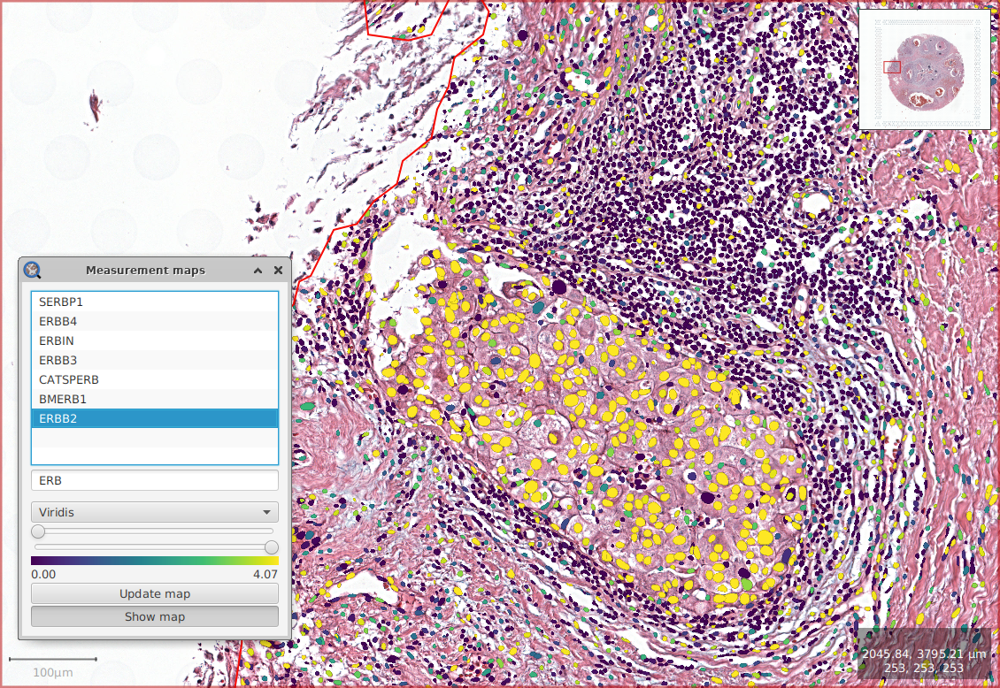

# Single Cell Gene Expression Prediction using H&E Images based on Spatial Transcriptomics

**Abstract** *In situ* RNA capturing represents an excellent opportunity for bridging transcriptomic data to a spatial domain, making it possible to map the gene expression to the corresponding anatomical structure. As a result, scientists can better understand the transcriptional heterogeneity with spatially re-solved, anatomical, and pathophysiological contexts. However, high throughput sequencing technologies paired with histological images suffer from lower resolution mapping between transcriptome and imaging data. Here, we present Spatial Transcriptome Auto-encoder & Deconvolution (ST-AnD), a scalable deep generative model for predicting gene expression at cellular or nuclei level based on H&E imaging and in situ RNA capturing, thus allowing a better understanding of the tissue microenvironment of a disease.

This reppository is for supporting our [to-be-published paper](https://arxiv.com).

## Model Architecture

This plot shows the diagram of the proposed model. ST-AnD model includes two parts: the first part is the ST-Image-Encoder, which converts the feature of an image to a data point in a lower-dimensional latent data space; The second part is ST-Genomic-Decoder, which bridges the above-mentioned latent data space to the corresponding spot gene expression profile. As a result, it can estimate the probability of gene expression for one or many cells under the same spot and map these cells to the expression data of the spot. In this way, we estimate the gene expression distribution of the highest probability density based on the cell image features.

## Results
T-Cell Biomarker (CD4)              |BRCA Her2+ Biomarker (ERBB2)
:----------------------------------:|:---------------------------------------:
|

The above shows the FFPE stained Human Breast Cancer sample obtained from 10x Genomics [Visium](https://www.10xgenomics.com/spatial-transcriptomics/) repository. The colorbar shows the predicted gene expression of the chosen gene. The biomarkers for lymphocytes and the tumor epithelials are expressed respectively.

For the details please see the [tutorial](./STAnD-tutorial.ipynb).